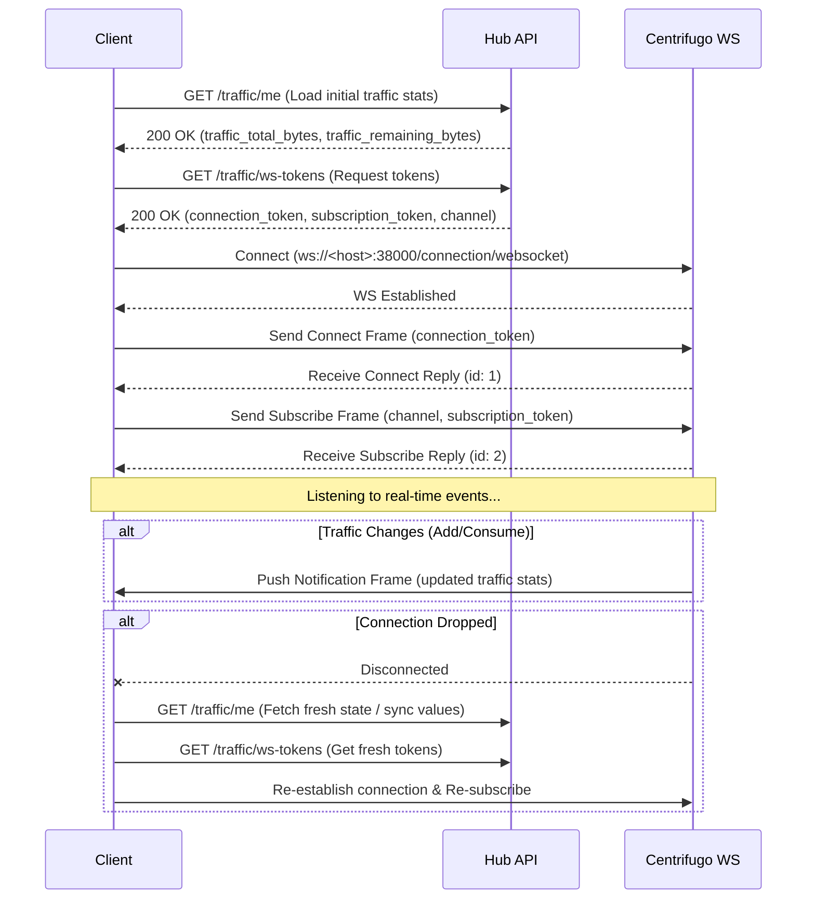

# Traffic WebSocket Integration Guide (Centrifugo)

This document describes how client applications (Mobile, Desktop, Web) integrate with the Centrifugo WebSocket server to receive real-time traffic limit updates (total and remaining traffic).

## Integration Flow

Since history and message recovery are disabled for the personal namespace, the client MUST follow this sequence:



---

## 1. Requesting WebSocket Tokens

Before connecting to the WebSocket server, the client must obtain connection and subscription tokens from the Hub API.

* **Endpoint:** `GET /traffic/ws-tokens`
* **Headers:** `Authorization: Bearer <jwt_access_token>`
* **Response DTO (`CentrifugeTokenDto`):**
  ```json
  {
    "status": "success",
    "data": {
      "connection_token": "eyJ0eXAiOiJKV1QiLCJhbGciOiJIUzI1NiJ9...",
      "subscription_token": "eyJ0eXAiOiJKV1QiLCJhbGciOiJIUzI1NiJ9...",
      "channel": "personal:5c841783-8f96-4fef-b268-3839f6c6baf0"
    }
  }
  ```

---

## 2. Connecting to WebSocket

Connect your WebSocket client to the Centrifugo endpoint:
* **Local Development:** `ws://localhost:38000/connection/websocket`
* **Production:** `wss://<your-domain>/connection/websocket` (or configured custom port)

---

## 3. Centrifugo Protocol Handshake

Centrifugo utilizes a simple frame framing protocol. Frames are sent as text messages.

### Step A: Send Connect Command
Send a JSON payload to authenticate the connection immediately after the WebSocket is opened:
```json
{
  "connect": {
    "token": "<connection_token>"
  },
  "id": 1
}
```

**Centrifugo Connect Reply:**
```json
{
  "id": 1,
  "connect": {
    "client": "6c39a659-eb2c-40a3-9655-b07e945daca9",
    "version": "5.2.2",
    "expires": true,
    "ttl": 86400,
    "ping": 25,
    "pong": true
  }
}
```

### Step B: Send Subscribe Command
Subscribe to the personal channel returned in the `CentrifugeTokenDto` (`channel` field):
```json
{
  "subscribe": {
    "channel": "personal:5c841783-8f96-4fef-b268-3839f6c6baf0",
    "token": "<subscription_token>"
  },
  "id": 2
}
```

**Centrifugo Subscribe Reply:**
```json
{
  "id": 2,
  "subscribe": {
    "expires": true,
    "ttl": 7200
  }
}
```

---

## 4. Handling Traffic Update Pushes

Whenever user traffic is consumed by a VPN node or new traffic is added via the API, Centrifugo pushes an update frame to the WebSocket:

```json
{
  "push": {
    "channel": "personal:5c841783-8f96-4fef-b268-3839f6c6baf0",
    "pub": {
      "data": {
        "traffic_total_bytes": 26843545600,
        "traffic_remaining_bytes": 24696061952
      }
    }
  }
}
```

* **`traffic_total_bytes`**: The sum of all active, non-expired packets' limits.
* **`traffic_remaining_bytes`**: The sum of all active packets' remaining traffic.

---

## 5. Reconnection & Recovery Policy

> [!IMPORTANT]
> **No History/Recovery:** The `personal` channel namespace has history disabled.
>
> When the client disconnects and reconnects (e.g. due to internet handovers, sleep mode, or network dropouts), it **must not** attempt recovery. Instead, it must make a standard HTTP request to `GET /traffic/me` to synchronize the absolute total/remaining traffic bytes, fetch fresh tokens from `GET /traffic/ws-tokens`, and perform the handshake sequence again.
