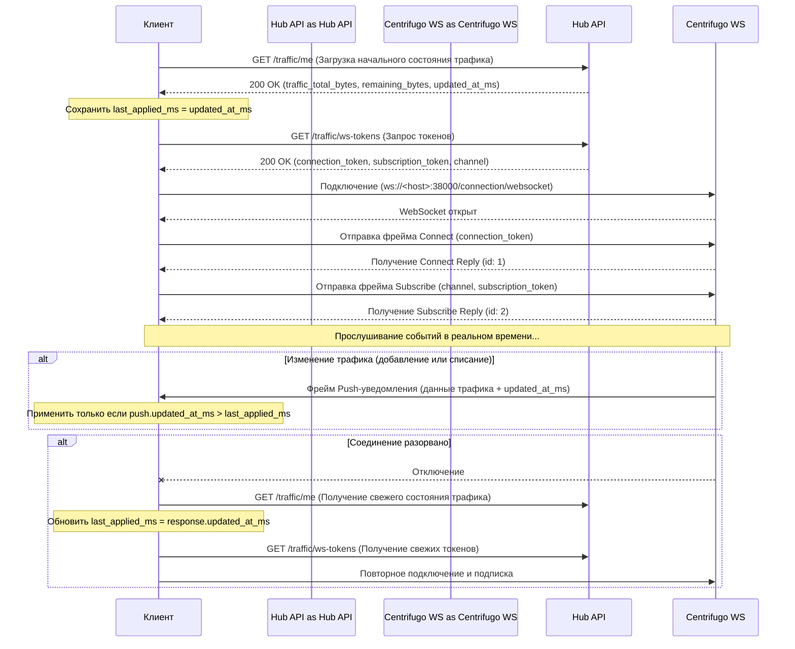

# Руководство по интеграции с Traffic WebSocket (Centrifugo)

В этом документе описывается, как клиентские приложения (мобильные, десктопные, веб) интегрируются с WebSocket-сервером Centrifugo для получения обновлений лимитов трафика в реальном времени.

## Схема интеграции

Поскольку история сообщений и механизм восстановления (recovery) отключены для персонального пространства имён, клиент ДОЛЖЕН следовать следующей схеме:



---

## 1. Получение WebSocket токенов

Перед подключением к WebSocket-серверу клиент должен получить токен подключения и подписки от API Hub.

* **Эндпоинт:** `GET /traffic/ws-tokens`
* **Заголовки:** `Authorization: Bearer <jwt_access_token>`
* **Ответ DTO (`CentrifugeTokenDto`):**
  ```json
  {
    "status": "success",
    "data": {
      "connection_token": "eyJ0eXAiOiJKV1QiLCJhbGciOiJIUzI1NiJ9...",
      "subscription_token": "eyJ0eXAiOiJKV1QiLCJhbGciOiJIUzI1NiJ9...",
      "channel": "personal:5c841783-8f96-4fef-b268-3839f6c6baf0"
    }
  }
  ```

---

## 2. Подключение по WebSocket

Подключите ваш WebSocket-клиент к эндпоинту Centrifugo:
* **Локальная разработка:** `ws://localhost:38000/connection/websocket`
* **Продакшн:** `wss://<your-domain>/connection/websocket` (или настроенный внешний порт)

---

## 3. Рукопожатие по протоколу Centrifugo

Centrifugo использует текстовые JSON-фреймы для взаимодействия.

### Шаг А: Отправка команды Connect
Сразу после открытия соединения отправьте JSON-команду для авторизации:
```json
{
  "connect": {
    "token": "<connection_token>"
  },
  "id": 1
}
```

**Ответ Centrifugo Connect Reply:**
```json
{
  "id": 1,
  "connect": {
    "client": "6c39a659-eb2c-40a3-9655-b07e945daca9",
    "version": "5.2.2",
    "expires": true,
    "ttl": 86400,
    "ping": 25,
    "pong": true
  }
}
```

### Шаг Б: Отправка команды Subscribe
Подпишитесь на персональный канал, полученный в поле `channel` в DTO ответа `CentrifugeTokenDto`:
```json
{
  "subscribe": {
    "channel": "personal:5c841783-8f96-4fef-b268-3839f6c6baf0",
    "token": "<subscription_token>"
  },
  "id": 2
}
```

**Ответ Centrifugo Subscribe Reply:**
```json
{
  "id": 2,
  "subscribe": {
    "expires": true,
    "ttl": 7200
  }
}
```

---

## 4. Обработка Push-уведомлений об изменении трафика

При любом списании трафика VPN-нодой или добавлении нового пакета через API, Centrifugo отправляет Push-фрейм в открытый WebSocket:

```json
{
  "push": {
    "channel": "personal:5c841783-8f96-4fef-b268-3839f6c6baf0",
    "pub": {
      "data": {
        "traffic_total_bytes": 26843545600,
        "traffic_remaining_bytes": 24696061952,
        "updated_at_ms": 1753192800000
      }
    }
  }
}
```

* **`traffic_total_bytes`**: Сумма лимитов всех активных, неистекших пакетов трафика пользователя.
* **`traffic_remaining_bytes`**: Сумма оставшегося трафика по всем активным пакетам.
* **`updated_at_ms`**: Unix-время последней записи в БД (миллисекунды). Используется как монотонный курсор (см. раздел ниже).

---

## 5. Решение гонки состояний REST vs WebSocket

Между HTTP-снимком состояния и WS-потоком существует классическая **гонка состояний (race condition)**:

```
Клиент              Сервер
  |                    |
  |--GET /traffic/me-->|    # запрос снимка состояния
  |                    |--push (updated_at_ms=T2)-->  # нода списала трафик
  |<--200 (T1)---------|    # устаревший ответ приходит ПОСЛЕ пуша
  # ❌ Клиент перетирает свежие данные T2 устаревшими T1
```

### Решение: монотонный курсор `updated_at_ms`

И `GET /traffic/me`, и каждый WS-пуш содержат поле `updated_at_ms` — это `MAX(modified_at)` всех активных пакетов, выраженный в Unix-миллисекундах.

**Псевдокод на стороне клиента:**
```swift
var lastAppliedMs: Int64 = 0

func applyTrafficState(totalBytes: Int64, remainingBytes: Int64, updatedAtMs: Int64) {
    guard updatedAtMs > lastAppliedMs else { return }  // устаревшее — игнорируем
    lastAppliedMs = updatedAtMs
    // обновляем UI
}

// При запуске приложения:
let snapshot = await GET("/traffic/me")          // { ..., updated_at_ms: T1 }
applyTrafficState(...snapshot, updatedAtMs: T1)
subscribeWebSocket()  // может принять пуши с T0..T1..T2

// На каждый WS-пуш:
let push = receivedPush.data                     // { ..., updated_at_ms: T2 }
applyTrafficState(...push, updatedAtMs: T2)       // T2 > T1 → применяем; T0 → игнорируем
```

> [!TIP]
> Порядок подписки на WS и HTTP-запроса **не важен**. Подпишись первым или запроси снимок первым — `updated_at_ms` всегда корректно расставит приоритет.

---

## 6. Политика переподключения и восстановления (Recovery)

> [!IMPORTANT]
> **Отсутствие истории/восстановления:** Пространство имен `personal` работает без записи истории сообщений.
>
> Когда клиент отключается и подключается заново (например, при смене сети Wi-Fi/LTE, выходе из спящего режима или сбое сети), он **не должен** пытаться запрашивать пропущенные сообщения. Вместо этого клиент должен выполнить обычный HTTP-запрос к `GET /traffic/me` для синхронизации текущих объемов трафика (и обновить `last_applied_ms`), запросить свежие токены через `GET /traffic/ws-tokens`, а затем заново подключиться к сокету и подписаться на канал.
